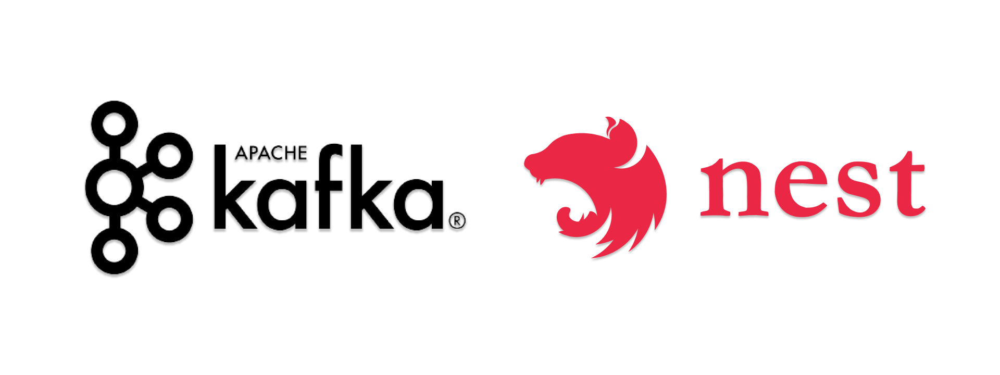

<p align="center">
  
</p>

<h3 align="center">
  Practical examples of how to use
  <a href="https://kafka.apache.org/">Apache Kafka®</a> on NodeJS with the
  <a href="https://nestjs.com/">NestJS</a> framework! 🚀
</h3>

## Pre-requisites

- [Docker](https://www.docker.com/): 19.03.13 or higher.
- [docker-compose](https://docs.docker.com/compose/install/): 1.27.4 or higher.

## Up and Running!

After installing all the requirements, run the `run.sh` file:

```bash
./run.sh
```

To test, just run the `curl` below:

```bash
curl http://localhost:8081 -w "\n"
# > {"consumerResponse":{"producerMessage":"Hello Kafka"}}
```
